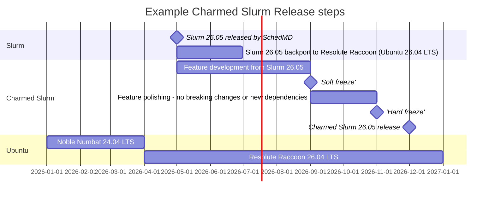

# Abstract

This spec details the release policy Charmed Slurm.

# Rationale

A consistent release policy is necessary to keep our community aware of upcoming major changes, bug fixes, and security updates, while ensuring that the community has some expected degree of stability.

Charmed Slurm components:

- Slurm machine charms
- `slurm-wlm` Debian packages

Since Charmed Slurm is a composition of multiple artifacts, there must be a well-defined release policy that developers and users can reference to know when they can expect things such as when the version of Slurm will be upgraded, when new features will be added to the charms, where they can go to get security updates, etc.

# Specification

## Charmed Slurm tracking upstream

SchedMD releases a new version of Slurm every six months, with bug and security fix support for an 18-month cycle.

[Source](https://www.schedmd.com/slurm-releases-move-to-a-six-month-cycle/)

Charmed Slurm's versioning will map to upstream release of Slurm that it operates. Example:

- Charmed Slurm 25.11 operates Slurm 25.11
- Charmed Slurm 26.04 operates Slurm 26.05

## Release cadence

Charmed Slurm will follow behind upstream Slurm releases by one release - approximately six months. Feature freeze for the next Charmed Slurm release will be up to 6 months after a new version of Slurm is released by SchedMD, with a soft freeze around the four month mark. This timeframe is for maintainers to add new features to the Slurm charms, and backport the previous release of Slurm to the current Ubuntu LTS release. Example schedule:

## Support life-cycle

Outside exceptional circumstances, each Charmed Slurm release will receive bug and security fix support for 1 year, following the upstream Slurm support life-cycle.

## Versioning scheme for Charmed Slurm

Version format: `<upstream Slurm version>-<minor/patch version #>`. Example Charmed Slurm release numbers:

- Charmed Slurm now includes Slurm 25.11: "25.11-0"
- Bugfix is released: "25.11-1"
- Security update is released: "25.11-2"

* Major release - new version of Slurm, feature changes, new Ubuntu base version
    * This version number will only change with the new version of Slurm. 
* Minor release - bug and security fixes
  * Note that running `juju refresh` is necessary to pull latest security and bug fix updates

The minor version numbers will be used for release notes and will list corresponding revision numbers for each charm. Unless explicitly stated otherwise, when a Charmed Slurm release is referenced - "25.11" - the latest minor patch in the stable branch is included. 

### Release channels

* Each major release has its own Charmhub track, e.g. "25.11"
* Each track has a corresponding GitHub branch, e.g. "25.11"
* Each track on Charmhub provides three channels:
   * Edge, the development channel
   * Candidate, to test the new release before publishing 
   * Stable
     * No breaking changes will be made to integrations, configuration options, or actions in a stable channel of a charm

## Documentation

Warnings/limitations that will be included in the published documentation alongside the release notes:

* Users are expected to use the charm version (Charmhub track) that comes with a specific Slurm release
  * For example, Charmed Slurm version 25.11 should *only* be use with the 25.11 release of Slurm 
* Due to potential breaking changes between major Slurm releases, Charmed Slurm cannot guarantee backwards compatibility with previous major Charmed Slurm versions
  * If a user requirement necessitates versions that are not from corresponding releases, they should open an issue on Github
(or Support Discussion) and contact the team

## Examples

### Anbox Cloud

[Anbox Release Page](https://documentation.ubuntu.com/anbox-cloud/en/latest/reference/release-notes/release-notes/)

* From home page, Roadmap has its own left-side TOC below contribute
* After selection: Roadmap appears only within references in left-side TOC
  * Preferred style, need to figure out sphinx set up
* Has recent releases and upcoming release roadmap
* Has defined release cycle and defined support policy

### Kubernetes

[Kubernetes Release Page](https://ubuntu.com/kubernetes/docs/release-notes)

* Release notes within refs section
  * Has a 'what's new' section
* No Roadmap

### MaaS

[Maas Release Page](https://maas.io/docs/reference-release-notes-maas-3-5)

* Each major release has a tab in Refs

# Release notes sections

General Release Notes sections:
* Long-term support or not
  * Length of 'long-term'
* Requirements and compatibility
* What's new
* Backwards incompatible changes
* Deprecated features

# References
* [Release Notes Format](https://docs.google.com/document/d/1L-FxU2Si7Mt6TqnTk_CZYPezAajsBKiGDNP65Pf688s/edit?tab=t.0#heading=h.g4gdk7o1d9xn)
* [Documentation Release Notes landing page Format](https://docs.google.com/document/d/187hrGJd-l9WkUarEqw7FLOu_X6k849xaiDp_T9HHDHI/edit?tab=t.0#heading=h.y7atuj5xt6qt)
* [Canonical product release cycles](https://ubuntu.com/about/release-cycle#ubuntu)
* [Kubeflow publish action for charms](https://github.com/canonical/charmed-kubeflow-workflows/blob/main/.github/workflows/_publish.yaml)
* [Other Kubeflow actions](https://github.com/canonical/charmed-kubeflow-workflows/tree/main/.github/workflows)

# Spec History and Changelog
| Date    | Status  | Author(s)           | Comment     |
|:--------|:--------|:--------------------|:------------|
| 2025-07-09 | Braindump | [Ashley Cliff](mailto:ashley.cliff@canonical.com) | Initial braindump |
| 2025-07-15 | Braindump | [Ashley Cliff](mailto:ashley.cliff@canonical.com) | Initial braindump |
| 2025-10-25 |           | [Ashley Cliff](mailto:ashley.cliff@canonical.com) | |
